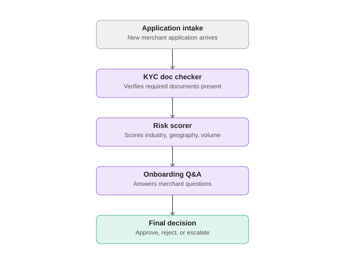
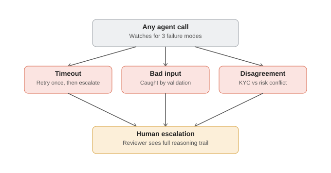

# Merchant Onboarding Multi-Agent Pipeline

A 4-agent pipeline (orchestrator + 3 specialist agents) that processes merchant
onboarding applications: document verification, risk scoring, and Q&A —
with explicit failure handling and full handoff logging.

## Architecture

**Main pipeline:**



**Failure handling and escalation paths:**



## Agents

| Agent | Responsibility | File |
|---|---|---|
| Orchestrator | Routes between agents, retries on timeout, resolves disagreement, makes final decision | `orchestrator.py` |
| KYC Doc Checker | Verifies required documents are present, flags missing/invalid | `agents/kyc_checker.py` |
| Risk Scorer | Scores 0-100 based on industry/country/volume/KYC status, with logged reasons | `agents/risk_scorer.py` |
| Onboarding Q&A | Answers merchant questions (FAQ lookup, swap for LLM+RAG easily) | `agents/onboarding_qa.py` |

## LLM integration (auto-detected, with safe fallback)

`llm.py` auto-detects whether `ANTHROPIC_API_KEY` is set in your environment:

- **Key not set** → the whole pipeline runs on deterministic rule-based logic.
  100% reproducible, no API key needed, works cold for anyone cloning the repo
  (including judges).
- **Key set** → `onboarding_qa.py` uses real Claude calls to answer merchant
  questions conversationally. If a real API call fails for any reason (network,
  rate limit, timeout), the agent automatically falls back to the rule-based FAQ
  lookup and logs why — the pipeline never crashes because of a flaky external call.

To enable real LLM calls:
```bash
pip install -r requirements.txt
export ANTHROPIC_API_KEY="your-key-here"   # Mac/Linux
$env:ANTHROPIC_API_KEY="your-key-here"     # Windows PowerShell
python run.py
```

## Failure handling and resilience

`test_failure_handling.py` deliberately forces three failure modes and asserts
the pipeline recovers correctly:

1. **Timeout** — an agent call is forced to raise `AgentTimeoutError`. Orchestrator
   retries once, then escalates to human review if still failing.
2. **Malformed input** — a validation guard in `kyc_checker.py` catches bad input
   (empty business name, non-dict documents field) before it can corrupt state
   downstream, and escalates immediately with the specific reason.
3. **Agent disagreement** — KYC passes an application as complete, but the risk
   scorer independently flags it HIGH risk. The disagreement is explicitly logged
   (`AGENT_DISAGREEMENT` flag) and the orchestrator's documented resolution rule
   (risk-scorer signal wins, both reasons surface) routes it to human escalation.

Run it: `python test_failure_handling.py`

## Handoff logging

Every agent transition — including retries — is logged with a timestamp, source
agent, destination agent, a human-readable reason, and a state snapshot. This is
what lets you answer "why did this happen" for any application, not just "what
happened." See `HandoffLogEntry` in `state.py`.

## Running the full pipeline

```bash
python run.py              # run all 15 mock applications, print summary + metrics
python run.py --verbose    # also print the full handoff log per application
python test_failure_handling.py   # run the three forced-failure scenarios
```

Output includes an aggregate metrics report (decision breakdown, average handoffs
per application, retry count, escalation rate) and writes `run_results.json` with
full structured results per application — this is the honest throughput/accuracy
data referenced in the project's Day 8 testing plan, not a single cherry-picked run.

## Mock data

`mock_data.py` contains 15 applications tagged by scenario (`clean`,
`missing_docs`, `high_risk`, `conflicting_signals`, `malformed`) reused across
agent development, failure-handling tests, and metrics reporting.

## Extending this

- Swap `llm.py`'s `call_llm()` for a real Anthropic API call to make
  `onboarding_qa.py` genuinely conversational
- Add a 4th risk factor (e.g. chargeback history) to `risk_scorer.py`
- The orchestrator's routing is currently linear (KYC → risk → QA); if you want
  a branching flow (e.g. skip QA if no questions submitted), that logic belongs
  in `orchestrator.run()`